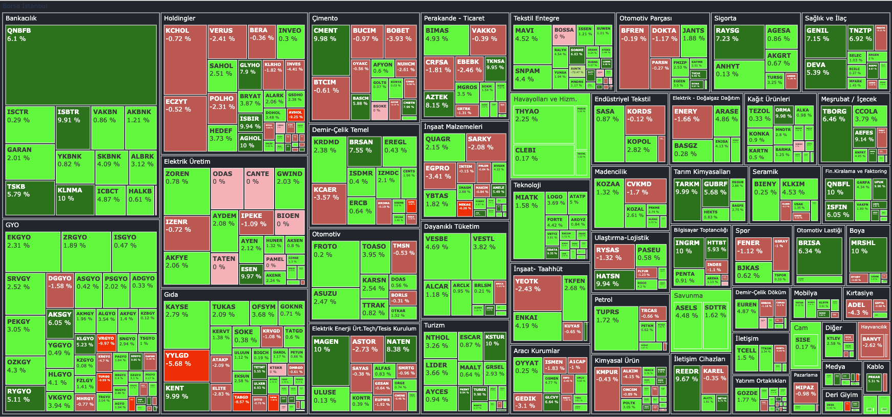

# Stock-Market-HeatMap

In this project we are create a sector-based segmented heatmap using stocks from BIST(Borsa İstanbul) closing prices obtained from İş Yatırım's website. 

[Is Yatirim Website](https://www.isyatirim.com.tr/tr-tr/Sayfalar/default.aspx).


Output of function should be look like this: 



## Environment

### MacOS

Use the [requirements](requirements.txt) file in this repo to create a new environment. For this you can either use `make setup` or the following commands:

```BASH
pyenv local 3.11.3
python -m venv .venv
source .venv/bin/activate
pip install --upgrade pip
pip install -r requirements.txt
```

### Windows

If you are working on Windows, type the following commands in the PowerShell:

```sh
python -m venv .venv
.venv\Scripts\Activate.ps1
pip install -r requirements.txt
```

*Note: If there are errors during environment setup, try removing the versions from the failing packages in the requirements file.*
